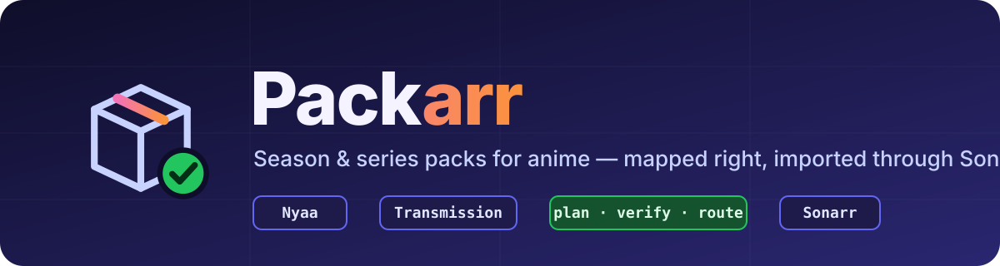
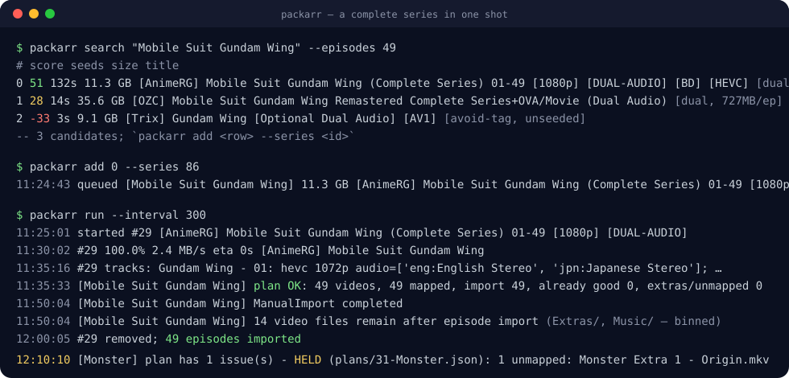
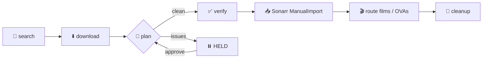

<p align="center">
  
</p>

<p align="center">
  <a href="https://github.com/GokuDoku/packarr/actions/workflows/ci.yml"></a>
  <a href="https://github.com/GokuDoku/packarr/pkgs/container/packarr"></a>
  
  <a href="LICENSE"></a>
  
</p>

<p align="center">
  <b>Season &amp; series packs for anime — mapped right, imported through Sonarr.</b><br>
  <sub>Sonarr can't parse a 74-episode batch. Nyaa is full of them. Packarr is the bridge.</sub>
</p>

<p align="center">
  <a href="#-quick-start">Quick start</a> ·
  <a href="#-how-it-works">How it works</a> ·
  <a href="#-commands">Commands</a> ·
  <a href="#-configuration">Configuration</a> ·
  <a href="#-auto-mode">Auto mode</a> ·
  <a href="#-faq">FAQ</a> ·
  <a href="#-ai-disclaimer">AI disclaimer</a>
</p>

---

## 🤔 Why

You add an anime to Sonarr. It's a finished show, and the best copy of it on earth is one torrent: the complete
series, dual audio, x265, one encoder, one look. Sonarr won't touch it — *"contains all episodes"* — so instead it
drip-feeds you 74 single-episode releases from six groups over a fortnight, half of them tagged wrong.

Packarr grabs the pack, works out **which file is which episode using the same mapping tables Kometa, Shoko and
HAMA use** (AniList → AniDB → TVDB via [Anime-Lists](https://github.com/Anime-Lists/anime-lists)), verifies the
result against the files themselves, and hands each one to Sonarr's `ManualImport` with an explicit episode id.
Sonarr stays the owner of your library: naming, history, upgrades, everything.

Films and OVAs riding along in the pack go to Sonarr's specials or to Radarr. Anything ambiguous is **held**, with the
proposed plan on disk for you to approve or hand-map. Nothing is guessed into your library.

## ✨ Features

| | |
|---|---|
| 🧭 **Real mapping** | AniList → AniDB → TVDB season + offset. Split cours ("Season 03" = TVDB S2), absolute-numbered packs, foreign subfolders, stale tables — handled and tested. |
| ✅ **Verify before import** | Runtime vs TVDB runtime, duplicate targets, files-per-season, season-size cross-check. Wrong → held, never imported. |
| 📥 **Through Sonarr, not around it** | `ManualImport` with explicit episode ids, pack-title quality, explicit language tags so your custom formats fire. |
| 🎬 **Movies & OVAs routed** | S00 special by TVDB title, else Radarr (added if new). Never duplicates, never overwrites a shared file. |
| 🎯 **Selective pulls** | `--abs 542-574` or `--dirs S03P01,S03P02` — pull 13 GB out of a 45 GB pack, unwanted files never allocate. |
| 🧠 **Language-aware** | Only re-imports episodes that lack the audio you want (Jellyfin's real streams when configured). `--all` for one consistent encode. |
| 💬 **Subtitle-aware** | `languages.subtitles: [eng, jpn]` — an episode only counts as done when its file carries those subtitle tracks too; packs advertising multi-subs rank higher; `subtitles_required` holds packs without them. |
| 📝 **Subtitles without re-downloading** | `packarr subs --fetch` finds every file missing a wanted subtitle language and asks **Bazarr** to fetch just those — automatically after each pack import when Bazarr is configured. |
| ⏸️ **Held plans you can fix** | `packarr plan`, `packarr approve --map file=episodeId`. Hand maps beat every filter. |
| 🤖 **Auto mode (opt-in)** | Sonarr "On Series Add" webhook → is it pack-worthy? → grab the best pack → cancel the racing usenet searches. Dry-run by default. |
| 💾 **Disk-budget aware** | Counts pre-allocated bytes, keeps a free-space floor, caps concurrency. |
| 🪶 **Tiny** | One dependency (PyYAML), plain `urllib`, ffprobe. Reads top to bottom. |

<p align="center">
  
</p>

## 🚀 Quick start

### Docker (recommended)

```bash
mkdir packarr && cd packarr
curl -fsSL https://raw.githubusercontent.com/GokuDoku/packarr/main/docker-compose.example.yml -o docker-compose.yml
docker run --rm -v "$PWD:/config" ghcr.io/gokudoku/packarr packarr init /config/packarr.yml
# edit packarr.yml (URLs, keys, the three views of your downloads folder), then:
docker compose up -d
docker compose exec packarr packarr check
```

### pip

```bash
pip install git+https://github.com/GokuDoku/packarr
packarr init && $EDITOR packarr.yml
packarr check
# cron:  */5 * * * * packarr run      — or —      packarr run --interval 300
```

### Your first pack

```bash
packarr search "Cowboy Bebop" --episodes 26         # ranked candidates from Nyaa (via Prowlarr)
packarr add 0 --series 42                           # row 0, Sonarr series id 42
packarr status                                      # queued → downloading → importing → done
```

That's it. The tick downloads it, plans it, imports what's needed, routes the movie to Radarr, deletes the folder.

> **Three views of one folder.** Packarr, Transmission and Sonarr may each see the completed-downloads folder at a
> different path. Set all three under `paths:` — everything else follows from that.

## 🔬 How it works



1. **Plan** — every video in the pack gets a proposed episode, in this order of authority: your hand map →
   `--map` season remaps → the anime-lists resolver on the folder/pack title → `SxxEyy` / `2x11` in the filename →
   season tokens + episode numbers → special titles.
2. **Verify** — runtime within 0.6–2.3× TVDB's, no two files on one episode, files-per-season ≤ episodes, mapping-table
   size == TVDB season size. Any failure holds the plan.
3. **Import** — only the episodes that need it (missing, or lacking the wanted audio), via `ManualImport` with
   explicit ids, quality from the pack title, your language tags.
4. **Route** — leftover films/OVAs to a matching S00 special, else Radarr.
5. **Cleanup** — forget the torrent, delete the folder at idle priority.

The long version, with every rule and why it exists: **[docs/how-it-works.md](docs/how-it-works.md)** ·
**[docs/field-notes.md](docs/field-notes.md)**

## 🧰 Commands

| Command | What it does |
|---|---|
| `packarr init [path]` | write an example `packarr.yml` |
| `packarr check` | test Sonarr, Transmission, optional Radarr/Jellyfin/Prowlarr, the downloads path and the mapping tables |
| `packarr search "<title>" [--episodes N] [--dual]` | ranked pack candidates; explains each score |
| `packarr add <row\|magnet> --series <id>` | queue a pack. Options below. |
| `packarr adopt <torrent id> --series <id>` | take over a torrent you added to the client by hand |
| `packarr run [--interval S]` | one pipeline tick (cron), or a daemon |
| `packarr status [--all]` | jobs and their state |
| `packarr plan <job>` | re-plan a job's folder and print the proposal without importing |
| `packarr approve <job> [--map path=episodeId ...] [--map-file f.json] [--keep]` | release a held job, optionally with hand mappings |
| `packarr subs [--series <id>] [--fetch]` | episodes whose files lack a wanted subtitle language; `--fetch` asks Bazarr for exactly those |
| `packarr serve` | webhook listener for auto mode |

**`add` options**

| Option | Use it when |
|---|---|
| `--all` | you want one consistent encode across the series, not just the gaps |
| `--langs japanese` | the pack is subs-only (uncensored releases usually are) — don't tag it as dual |
| `--map 21:18:43` | the pack's season numbers are a known lie (US-numbered dub sets: its "S21" is TVDB S18 from E44) |
| `--abs 542-574,783-891` | pull only these absolute episodes from a giant batch |
| `--dirs S03P01,S03P02` | pull only files whose path contains one of these (multi-season packs with `SxxEyy` names) |
| `--info <nyaa view url>` | when adding by magnet, lets Packarr fetch the `.torrent` (magnets stall behind VPNs) |

## ⚙️ Configuration

`packarr init` writes a commented example. Every value accepts `${ENV_VAR}`.

```yaml
sonarr:      { url: http://sonarr:8989,   api_key: ${SONARR_API_KEY} }
radarr:      { url: http://radarr:7878,   api_key: ${RADARR_API_KEY}, anime_root: /movies/anime, quality_profile: 1 }   # optional
prowlarr:    { url: http://prowlarr:9696, api_key: ${PROWLARR_API_KEY}, indexer_ids: [1] }                            # search + auto
jellyfin:    { url: http://jellyfin:8096, api_key: ${JELLYFIN_API_KEY} }                                              # optional
transmission: { url: http://transmission:9091/transmission/rpc, username: "", password: "" }

paths:
  downloads_local:  /downloads   # as Packarr sees it
  downloads_client: /downloads   # as Transmission sees it
  downloads_sonarr: /downloads   # as Sonarr/Radarr see it
  state_dir: /config

limits:    { max_active: 6, max_active_gb: 300, min_free_gb: 100 }
languages: { wanted: eng, tag: [English, Japanese], subtitles: [eng, jpn], subtitles_required: false }
bazarr:    { url: http://bazarr:6767, api_key: ${BAZARR_API_KEY}, fill_after_import: true }                          # optional
search:    { min_seeders: 2, prefer_groups: [Judas, EMBER, "Anime Time", DB, Cleo, YakuboEncodes, bonkai77] }
auto:      { enabled: false, dry_run: true, listen: 0.0.0.0:7979, min_months_ended: 2, notify_url: "" }
```

**Sonarr side (recommended):** a custom format that requires *languages: English + Japanese* scored high enough to
beat single-language files, and a low tiebreaker penalty (not −10000) on the "Anime LQ" group list — otherwise pack
imports from Judas/EMBER/Anime Time can never be upgrades. Packarr stamps the languages; the CF does the rest.

## 💬 Subtitles

Audio was the original job; subtitles came from the first feature request. Two halves:

1. **Targeting.** `languages.subtitles: [eng, jpn]` makes an episode count as "already good" only when its file carries
   those subtitle tracks as well as the wanted audio (Jellyfin's stream data — Sonarr knows nothing about subtitles).
   Search ranks releases that advertise `Multi-Subs`/`Eng Sub` higher, the post-download probe reports each file's
   subtitle languages, and `languages.subtitles_required: true` holds a pack whose files lack one instead of importing it.
2. **Filling, without re-downloading.** With `bazarr:` configured, `packarr subs --fetch` walks your anime (or one
   `--series`), finds every file missing a wanted subtitle language, and asks Bazarr to fetch exactly those
   episode/language pairs. It also runs automatically after each pack import (`bazarr.fill_after_import`). Bazarr does the
   provider work (OpenSubtitles etc.) and writes the sidecar files; Packarr just tells it what's missing. Make sure the
   languages are enabled in Bazarr's language profile for those series.

## 🤖 Auto mode

> *"I request an anime — if it likely has a complete series, grab the complete series, map it right, import through Sonarr."*

1. Sonarr → Settings → Connect → Webhook → **On Series Add** → `http://packarr:7979/webhook/sonarr`
2. `packarr serve` (the `packarr-hook` service in the compose example)
3. `auto.enabled: true`, keep `dry_run: true` until the log shows decisions you agree with

The gate is deliberately conservative: **anime only** (Sonarr series type), **ended** or every season but the airing
one finished > `min_months_ended` ago, and a pack candidate with a positive score. When it grabs, it cancels Sonarr's
queued searches for that series so usenet singles don't race the pack; after import, whatever the pack didn't cover
(an airing season, specials) is Sonarr's again. Held plans go to `notify_url` (ntfy, Apprise, any URL that accepts a POST).

## ❓ FAQ

<details>
<summary><b>Why not Shoko / Shokofin?</b></summary>

Shoko is the right answer if you want AniDB as the *organising principle* of your library (cour-named seasons in
the player, AniDB metadata everywhere). It's another server, an AniDB account with rate limits, and a library
migration. Packarr keeps Sonarr + TVDB as the organising principle and uses the anime-lists tables only to get
files into the right TVDB slot. Different trade.
</details>

<details>
<summary><b>Why does a plan get HELD?</b></summary>

Because something didn't add up: a file's runtime is wrong for its episode, two files claim one episode, a folder
has more files than the season has episodes, or a numbered file has no target. Run `packarr plan <job>`, read the
`reason`/`note` per row, then `packarr approve <job> --map "<rel path>=<episode id>"` for the ones you can settle.
The pack stays on disk, stopped, until you do. See the [field notes](docs/field-notes.md) for the usual suspects.
</details>

<details>
<summary><b>The pack has "dual" in the title but the files are Japanese-only.</b></summary>

`[Optional Dual Audio]` means subs only. Packarr ranks those down (`search.avoid_regex`), logs a 3-file ffprobe
sample when the download finishes, and stamps whatever you pass in `--langs` — the release name is a hint, the file
is the truth.
</details>

<details>
<summary><b>qBittorrent / SABnzbd?</b></summary>

Transmission today. The client is one small class (`packarr/clients/transmission.py`) behind the pipeline; a
qBittorrent port is a welcome PR — the pipeline only needs add/list/stop/start/remove and per-file selection.
</details>

<details>
<summary><b>Can it run without Prowlarr?</b></summary>

Yes — `packarr add <magnet or .torrent URL> --series <id> --title "..." --info <nyaa url>` skips search entirely.
Prowlarr is only for `search` and auto mode.
</details>

## 🧪 Tests

```bash
pip install -e ".[dev]" && pytest -q
```

The planner is pure logic once its collaborators are injected; `tests/test_planner.py` is a list of real packs that
broke a previous rule (an `S3_-_07` that mapped to season 1, a `2x11` naming style, a split cour, a Sailor Moon
pack with a *Crystal* subfolder, a US-numbered Pokémon set …). Add yours with the fixture helpers in
`tests/conftest.py`.

## 🗺️ Roadmap

- [x] subtitle targeting + Bazarr fill (v0.2.0, first user request)
- [ ] qBittorrent client
- [ ] SABnzbd / usenet packs
- [ ] web page for held plans (approve / map in the browser)
- [ ] XEM as a second opinion when anime-lists and TVDB disagree
- [ ] `packarr audit` — find episodes whose filename `SxxEyy` no longer matches their Sonarr episode (TVDB renumbered under you)

## 🤝 Credits

- [Anime-Lists/anime-lists](https://github.com/Anime-Lists/anime-lists) and [Fribb/anime-lists](https://github.com/Fribb/anime-lists) — the mapping tables. Fix wrong mappings *there*; every tool benefits.
- [AniList](https://anilist.co) — title search.
- [Sonarr](https://sonarr.tv), [Radarr](https://radarr.video), [Prowlarr](https://prowlarr.com), [Transmission](https://transmissionbt.com) — the stack.
- [TRaSH Guides](https://trash-guides.info) — custom-format thinking.
- The encoders whose complete batches make any of this worth doing.

## 🧾 AI disclaimer

Packarr was designed and written **with Claude (Anthropic) as the primary author of the code**, working alongside
a human operator on a real library over several days. Every rule in the planner came from a pack that broke the
previous rule on that library; the human chose the policy, reviewed the plans, and pulled the trigger on imports.

That has consequences you should know about:

- The code has been exercised against **one** library (a few hundred anime series, ~70 packs, Transmission behind a
  VPN, Sonarr v4, Jellyfin). Your naming conventions, client and edge cases may differ. **Run with the defaults —
  `auto.dry_run: true` — and read your first few plans before trusting it.**
- Nothing in Packarr deletes from your *library*: imports go through Sonarr, which applies its own upgrade rules.
  It does delete **download folders** after a successful import. Keep a recycle bin on if you want a safety net.
- Bugs and blind spots are likely in places the one library never exercised. Issues with the pack layout and the
  plan file are the fastest way to fix them — the [mapping issue template](.github/ISSUE_TEMPLATE/mis-mapped-pack.md)
  asks for exactly what's needed.

Use it, read it, and file what breaks. 🙏

---

<p align="center"><sub>MIT · not affiliated with Sonarr, Nyaa, AniList or Anime-Lists</sub></p>
