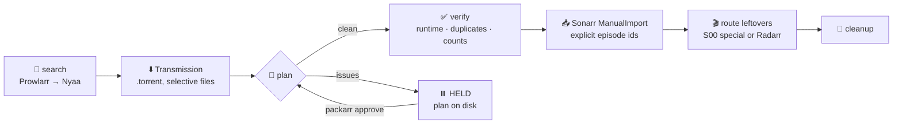

# 🔬 How Packarr maps a pack

Sonarr's parser gives up on multi-season packs ("contains all episodes"), and anime numbering disagrees with
itself across every database. Packarr doesn't guess — it asks the same tables that Kometa, HAMA and Shoko use,
verifies the answer against the files, and refuses to import when anything is off.

## The pipeline

Every step runs from a single `packarr run` tick (cron or `--interval`). State is one JSON file; every plan
is written to `plans/` so you can inspect it before anything moves.

## Order of authority when mapping a file

1. **Hand map** — `packarr approve <job> --map "path.mkv=<episode id>"`. Always wins, even over the extras filter
   (so `NC/OP.mkv` can be pinned to a TVDB "Opening Creditless" special when one exists).
2. **`--map` season remaps** — for packs whose *own* season numbers are known lies (US-numbered dub sets:
   "Season 21" is TVDB S18 from E44 → `--map 21:18:43`).
3. **The resolver** — folder or pack title → AniList → AniDB id ([Fribb/anime-lists](https://github.com/Fribb/anime-lists))
   → TVDB season + episode offset ([Anime-Lists](https://github.com/Anime-Lists/anime-lists)). This is how
   "Bungou Stray Dogs Season 03" becomes TVDB **S2** (a split cour), and how a `Crystal/` subfolder inside a
   Sailor Moon pack lands in the *Sailor Moon Crystal* series instead.
4. **`SxxEyy` / `2x11` in the filename** — when that episode exists.
5. **Season tokens + episode numbers** — folder names, then filenames, then (for root-level files) the pack title.
   A pack of numbered folders that form one continuous run (`Season 1/01-25`, `Season 2/26-37`) is treated as
   absolutely numbered.
6. **Special titles** — an optional AniDB dump (Shoko's `Anime_HTTP` format) and Sonarr's own S00 titles, by
   token overlap.

What Packarr will **not** do: assume season 1. If the title can't be resolved and the pack title names another
season, the file is left unmapped and the plan is held.

## Verification (what makes a plan HELD)

| Check | Why it exists |
|---|---|
| runtime within 0.6–2.3× the TVDB runtime | a 9-minute recap wearing an episode number once tried to replace a real episode |
| no two files on one episode (unless one is a `(1)`/`v2` duplicate) | split-cour packs and absolute/season confusion both show up here first |
| files per season ≤ episodes per season | a stale anime-lists table shows up as "26 files, 21 episodes" |
| anime-lists range size == TVDB season size | when they disagree the table is stale; Packarr maps positionally instead |
| every numbered file has a target | otherwise: HELD with the offending names in the log |

Long files with an episode number (≥ 40 min, > 2.3× runtime) are not errors — they're films, and go to the router.

## What gets imported

By default only the episodes that need it: Sonarr has no file, **or** the existing file lacks the wanted audio
(`languages.wanted`). With Jellyfin configured the audio check uses real `MediaStreams`; without it, Sonarr's
per-file language tags. `--all` replaces every mapped episode (one consistent encode across the series).

Every file is submitted to Sonarr's `ManualImport` with an explicit `episodeIds`, a quality taken from the
**pack title** (Sonarr guesses HDTV from a bare `[Group] Show - 01.mkv`), and the configured language tags —
so a "language: English + Japanese" custom format can score the import as an upgrade.

## Leftovers: films, OVAs, specials

After the episode import, every remaining video ≥ 40 minutes (or named like an OVA/movie) is routed:

1. a **Sonarr S00 special** whose TVDB title matches the filename — unless Radarr already holds it as a movie, or the
   special's "file" is really a season episode's file (Sonarr can share one file between two episodes; importing
   there would delete the episode);
2. otherwise **Radarr**: look the title up, add it under `radarr.anime_root` if new, manual-import.

Anything unresolved keeps the torrent stopped in place with `status: leftovers` and the file list on the job.

## Selective pulls

Huge packs (a 600 GB One Piece batch, a 45 GB S1–S4 set) don't need to land in full:

- `--abs 542-574,783-891` keeps files whose absolute number is in range;
- `--dirs S03P01,S03P02` keeps files whose path contains a substring.

Unwanted files are marked at **add time** from the `.torrent`, so a client with pre-allocation on never
reserves the space. (Never add a selective pull as a bare magnet — the client allocates the whole pack before
metadata arrives.)
